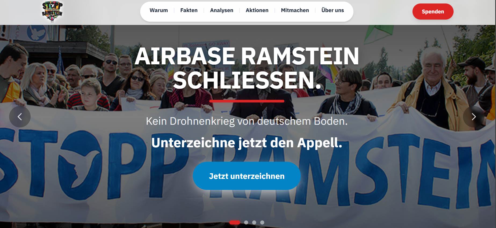

# Stopp Air Base Ramstein

Statische Website der Friedensinitiative „Stopp Air Base Ramstein“ ([stoppramstein.de](https://stoppramstein.de)) — Dokumentationsarchiv und Kampagnenplattform für die Schließung der US Air Base Ramstein.




## Status

Kernbereiche sind live: Warum-Ramstein-Argumente (4 Artikel), Analysen (2 Artikel), eine Aktion (Friedenswoche 2026), Mitmach-Seiten (Spenden, Mitgliedschaft, Ehrenamt, Aufruf) sowie die rechtlich nötigen Seiten (Impressum, Datenschutz, Kontakt, Presse, Über uns, Fakten). Laufende Redaktionsarbeit und bekannte offene Punkte: siehe [`docs/REDAKTION-TODO.md`](docs/REDAKTION-TODO.md).

## Schnellstart

```bash
git clone https://github.com/Acephali92/SAR2.0.git
cd SAR2.0
npm install
npm run dev
```

Dev-Server: `http://localhost:4321`. Voraussetzung: Node.js ≥ 22.

## Befehle

| Befehl | Zweck |
|--------|-------|
| `npm run dev` | Entwicklungsserver |
| `npm run build` | Produktions-Build nach `dist/` (inkl. Pagefind-Suchindex) |
| `npm run preview` | Produktions-Build lokal ansehen |
| `npm run typecheck` | TypeScript-/Schema-Prüfung |
| `npm run check-links` | Interne Links im Build-Output prüfen |
| `npm run check-csp` | Build-Output auf Inline-Scripts/CSP-Verstöße prüfen |
| `npm run verify` | typecheck + build + check-links — **vor jedem Commit ausführen** |

## Stack

Astro 5.x (statische Ausgabe) · Tailwind CSS 3.x · Astro Content Collections mit Zod-Validierung · Pagefind-Suche · TypeScript (strict). Details: [`docs/ARCHITEKTUR.md`](docs/ARCHITEKTUR.md).

## Dokumentation

| Dokument | Inhalt |
|----------|--------|
| [`CLAUDE.md`](CLAUDE.md) | Verbindliche Kurzregeln für Code-Änderungen (Stack, Verbote, CSP) |
| [`guidelines.md`](guidelines.md) | Ausführliche Projektregeln |
| [`docs/ARCHITEKTUR.md`](docs/ARCHITEKTUR.md) | Datenfluss, Komponenten, Content-Schema, Verzeichnisstruktur (mit Diagrammen) |
| [`docs/DEPLOYMENT.md`](docs/DEPLOYMENT.md) | Server-Konfiguration (Caddy/nginx), CSP-Header, Rebuild-Prozess, Team-Vorschau |
| [`docs/INHALTE-PFLEGEN.md`](docs/INHALTE-PFLEGEN.md) | Anleitung für Redakteur:innen zum Bearbeiten von Inhalten |
| [`docs/REDAKTION-TODO.md`](docs/REDAKTION-TODO.md) | Unbelegte Aussagen, bekannte offene Probleme |
| [`CONTRIBUTING.md`](CONTRIBUTING.md) | Setup und Ablauf für Ehrenamtliche |

## Lizenz / Kontakt

Kontakt: `info@stoppramstein.de`. Rechtliche Angaben: [`/impressum/`](https://stoppramstein.de/impressum/).
