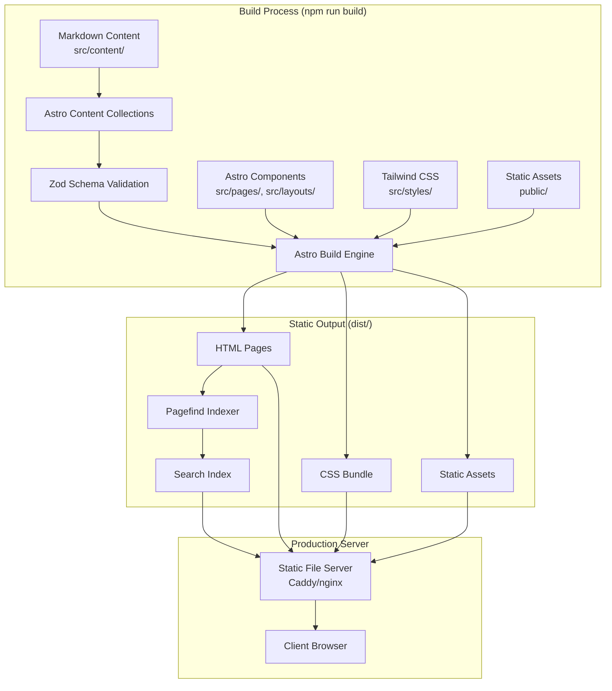
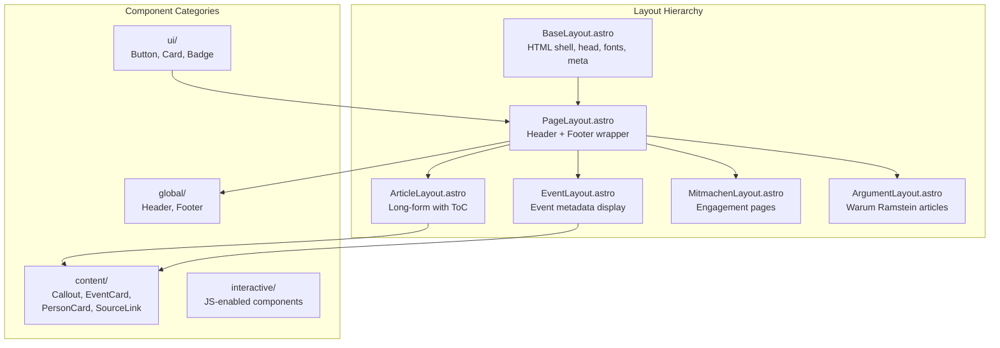
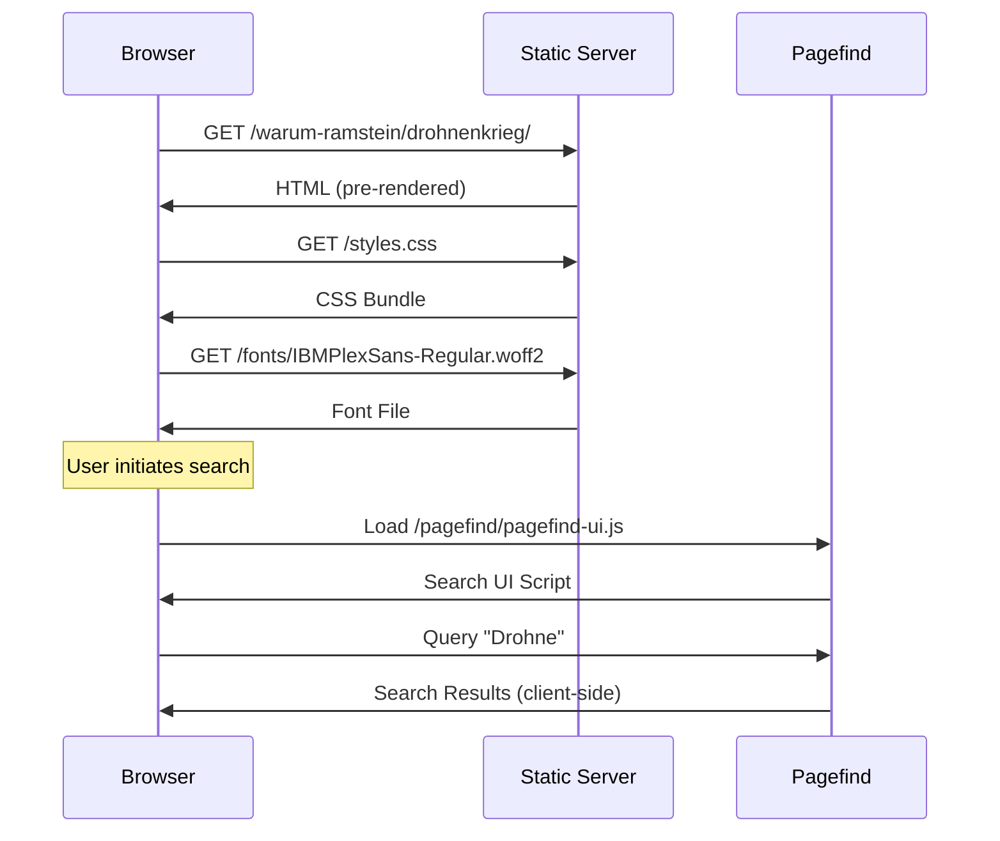
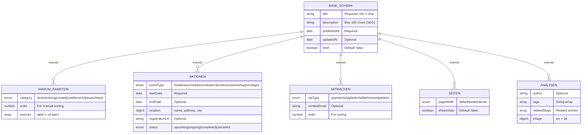
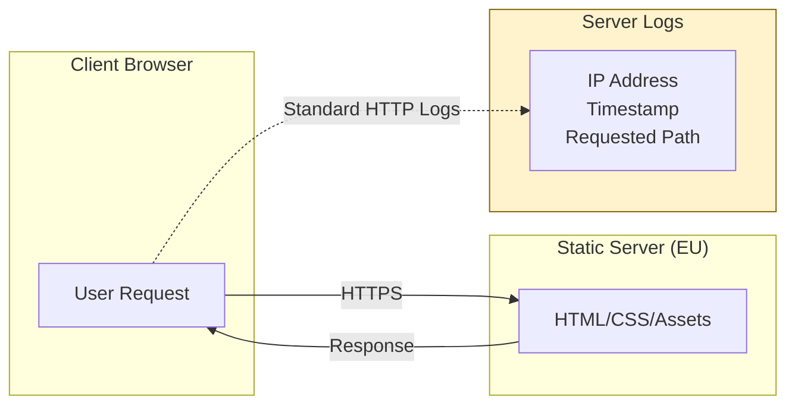

# SAR 2.0 - Stopp Air Base Ramstein Website

Static website for the German peace initiative "Stopp Air Base Ramstein" ([stoppramstein.de](https://stoppramstein.de)).

**Document Version:** 1.0
**Last Updated:** 2026-01-31

---

## Table of Contents

1. [System Overview](#system-overview)
2. [Quick-Start Guide](#quick-start-guide)
3. [Environment Configuration](#environment-configuration)
4. [Tech Stack](#tech-stack)
5. [Architecture](#architecture)
6. [Directory Structure](#directory-structure)
7. [Content Collections](#content-collections)
8. [Layouts Reference](#layouts-reference)
9. [Components Reference](#components-reference)
10. [Security & Privacy (GDPR)](#security--privacy-gdpr)
11. [Deployment](#deployment)
12. [Constraints & Conventions](#constraints--conventions)

---

## System Overview

### Purpose

This website serves as:

| Function | Description |
|----------|-------------|
| **Public Documentation Archive** | Permanent, citable record of evidence regarding U.S. military operations via Ramstein Air Base |
| **Credible Reference Source** | Resource for journalists, researchers, and policymakers |
| **Campaign Platform** | Mobilization tool for peace activism with clear calls to action |
| **Long-Term Maintainable Codebase** | System maintainable by volunteers with varying technical skills |

### Non-Functional Requirements

| Requirement | Target |
|-------------|--------|
| **Accessibility** | WCAG 2.1 AA compliance |
| **Performance** | Lighthouse score ≥90 on all metrics |
| **Privacy** | Zero third-party tracking; no cookies requiring consent |
| **Data Sovereignty** | No dependencies on U.S.-based CDNs in production |
| **Longevity** | Static output; no runtime dependencies |

---

## Quick-Start Guide

### Prerequisites

| Requirement | Version | Notes |
|-------------|---------|-------|
| Node.js | ≥22.0.0 | LTS required |
| npm | Latest | Do not use yarn/pnpm/bun |

### Installation

```bash
# Clone the repository
git clone <repository-url>
cd SAR2.0

# Install dependencies
npm install

# Start development server
npm run dev
```

Development server runs at: `http://localhost:4321`

### Available Scripts

| Command | Description |
|---------|-------------|
| `npm run dev` | Start dev server on port 4321 |
| `npm run build` | Production build to `/dist/` |
| `npm run preview` | Preview production build locally |
| `npm run postbuild` | Generate Pagefind search index (runs automatically after build) |
| `npm run typecheck` | TypeScript validation |
| `npm run verify` | Run typecheck + build (CI validation) |

### Build Verification

```bash
# Full verification before deployment
npm run verify

# Manual build + search index
npm run build && npm run postbuild
```

---

## Environment Configuration

This project requires **no environment variables** for development or production. All configuration is embedded in versioned files.

### Build-Time Configuration

| File | Purpose |
|------|---------|
| `astro.config.mjs` | Site URL, output mode, integrations |
| `tailwind.config.mjs` | Design system tokens (colors, fonts, spacing) |
| `tsconfig.json` | TypeScript compiler options, path aliases |
| `package.json` | Dependency versions, npm scripts |

### Production Site URL

Configured in `astro.config.mjs`:

```javascript
site: 'https://stoppramstein.de'
```

Modify before deployment if using a different domain.

### Path Aliases

| Alias | Resolves To |
|-------|-------------|
| `@/*` | `src/*` |
| `@components/*` | `src/components/*` |
| `@layouts/*` | `src/layouts/*` |
| `@content/*` | `src/content/*` |
| `@utils/*` | `src/utils/*` |
| `@styles/*` | `src/styles/*` |

---

## Tech Stack

### Core Technologies

| Layer | Technology | Version | Purpose |
|-------|------------|---------|---------|
| **Framework** | Astro | 5.1.1 | Static site generation, zero JS by default |
| **Content** | Astro Content Collections | — | Type-safe Markdown with Zod validation |
| **Styling** | Tailwind CSS | 3.4.17 | Utility-first CSS framework |
| **Typography** | @tailwindcss/typography | 0.5.16 | Prose styling for articles |
| **Type Safety** | TypeScript | 5.7.3 | Strict mode enabled |

### Development Dependencies

| Package | Version | Purpose |
|---------|---------|---------|
| `pagefind` | 1.3.0 | Static search index generation |
| `@phosphor-icons/web` | 2.1.1 | Icon library (MIT license) |
| `sharp` | 0.33.5 | Image optimization |

### Self-Hosted Assets

| Asset | Location | Notes |
|-------|----------|-------|
| IBM Plex Sans | `/public/fonts/` | Regular, Medium, SemiBold, Bold weights |
| IBM Plex Serif | `/public/fonts/` | Regular, Italic, SemiBold weights |
| IBM Plex Mono | `/public/fonts/` | Regular weight |

---

## Architecture

### System Data Flow



### Component Hierarchy



### Request Flow (Static Site)



### Content Collection Schema



---

## Directory Structure

```
SAR2.0/
├── src/
│   ├── content/               # Astro Content Collections
│   │   ├── config.ts          # Schema definitions (SINGLE SOURCE OF TRUTH)
│   │   ├── warum-ramstein/    # Core campaign arguments
│   │   │   ├── index.md
│   │   │   ├── drohnenkrieg.md
│   │   │   ├── voelkerrecht.md
│   │   │   ├── deutschland.md
│   │   │   └── umwelt.md
│   │   ├── aktionen/          # Events (current/archived)
│   │   │   └── friedenswoche-2026.md
│   │   ├── mitmachen/         # Engagement pages
│   │   │   ├── spenden.md
│   │   │   ├── mitglied-werden.md
│   │   │   ├── ehrenamt.md
│   │   │   └── aufruf.md
│   │   ├── seiten/            # Static pages
│   │   │   ├── impressum.md
│   │   │   ├── kontakt.md
│   │   │   ├── ueber-uns.md
│   │   │   └── fakten.md
│   │   └── analysen/          # Geopolitical analysis (ready for content)
│   │
│   ├── pages/                 # File-based routing
│   │   ├── index.astro        # Homepage
│   │   ├── impressum.astro
│   │   ├── kontakt.astro
│   │   ├── ueber-uns.astro
│   │   ├── fakten.astro
│   │   ├── warum-ramstein/
│   │   │   ├── index.astro
│   │   │   └── [...slug].astro
│   │   ├── mitmachen/
│   │   │   ├── index.astro
│   │   │   └── [...slug].astro
│   │   └── aktionen/
│   │       ├── index.astro
│   │       └── [...slug].astro
│   │
│   ├── layouts/               # Page templates
│   │   ├── BaseLayout.astro   # HTML shell, <head>, fonts
│   │   ├── PageLayout.astro   # Standard page wrapper
│   │   ├── ArticleLayout.astro
│   │   ├── EventLayout.astro
│   │   ├── MitmachenLayout.astro
│   │   └── ArgumentLayout.astro
│   │
│   ├── components/            # Reusable UI components
│   │   ├── global/
│   │   │   ├── Header.astro
│   │   │   └── Footer.astro
│   │   ├── ui/
│   │   │   ├── Button.astro
│   │   │   ├── Card.astro
│   │   │   └── Badge.astro
│   │   ├── content/
│   │   │   ├── Callout.astro
│   │   │   ├── EventCard.astro
│   │   │   ├── PersonCard.astro
│   │   │   └── SourceLink.astro
│   │   └── interactive/       # JS-enabled components
│   │
│   └── styles/
│       ├── global.css         # Tailwind directives + CSS variables
│       └── fonts.css          # @font-face declarations
│
├── public/                    # Static assets (copied as-is)
│   ├── fonts/
│   │   ├── IBMPlexSans-*.woff2
│   │   ├── IBMPlexSerif-*.woff2
│   │   └── IBMPlexMono-Regular.woff2
│   └── images/
│       ├── Logo_Header.png
│       ├── slide1-5.jpg
│       └── [CTA images]
│
├── stoppramstein_content/     # Legacy content (migration source)
├── dist/                      # Build output (git-ignored)
│
├── astro.config.mjs           # Astro configuration
├── tailwind.config.mjs        # Design system
├── tsconfig.json              # TypeScript config
├── guidelines.md              # Project rules (600+ lines)
└── package.json               # Dependencies and scripts
```

---

## Content Collections

### Schema Definition

All schemas are defined in `src/content/config.ts`. Build fails if content does not match schema.

### Base Schema (All Collections)

```typescript
const baseSchema = z.object({
  title: z.string().min(1, 'Title is required'),
  description: z.string().max(160, 'Description must be 160 characters or less'),
  publishedAt: z.coerce.date(),
  updatedAt: z.coerce.date().optional(),
  draft: z.boolean().default(false),
});
```

### Collection-Specific Fields

#### warum-ramstein

| Field | Type | Required | Description |
|-------|------|----------|-------------|
| `category` | `enum` | Yes | `drohnenkrieg`, `umwelt`, `voelkerrecht`, `deutschland` |
| `order` | `number` | No | Manual sort order (default: 0) |
| `sources` | `array` | No | `{ label: string, url: string }[]` |

#### aktionen

| Field | Type | Required | Description |
|-------|------|----------|-------------|
| `eventType` | `enum` | Yes | `friedenswoche`, `demonstration`, `konferenz`, `workshop`, `sonstiges` |
| `startDate` | `date` | Yes | Event start date |
| `endDate` | `date` | No | Event end date |
| `location` | `object` | Yes | `{ name, address?, city? }` |
| `registrationUrl` | `string` | No | External registration link |
| `status` | `enum` | No | `upcoming`, `ongoing`, `completed`, `cancelled` |

#### mitmachen

| Field | Type | Required | Description |
|-------|------|----------|-------------|
| `ctaType` | `enum` | Yes | `spenden`, `mitgliedschaft`, `ehrenamt`, `petition` |
| `contactEmail` | `string` | No | Contact email address |
| `order` | `number` | No | Display order |

#### seiten

| Field | Type | Required | Description |
|-------|------|----------|-------------|
| `pageWidth` | `enum` | No | `default`, `wide`, `narrow` |
| `showInNav` | `boolean` | No | Include in navigation |

### Adding Content

1. Create `.md` file in appropriate collection folder
2. Add valid frontmatter matching schema
3. Run `npm run verify` to validate

**Example** (`src/content/warum-ramstein/example.md`):

```yaml
---
title: "Article Title"
description: "Max 160 chars for SEO"
publishedAt: 2026-01-15
category: drohnenkrieg
order: 5
sources:
  - label: "Source Name"
    url: "https://example.com/source"
---

Markdown content here...
```

---

## Layouts Reference

### BaseLayout.astro

**Location:** `src/layouts/BaseLayout.astro`

**Purpose:** HTML document shell with `<head>`, fonts, and global styles.

**Props:**

| Prop | Type | Required | Default | Description |
|------|------|----------|---------|-------------|
| `title` | `string` | Yes | — | Page title (appended to site name) |
| `description` | `string` | Yes | — | Meta description |
| `canonicalUrl` | `string` | No | Current URL | Canonical URL override |
| `ogImage` | `string` | No | `/images/og-default.jpg` | Open Graph image |
| `lang` | `string` | No | `'de'` | Document language |
| `noIndex` | `boolean` | No | `false` | Disable search indexing |

**Features:**
- Font preloading (IBM Plex Sans, Serif)
- Open Graph / Twitter Card meta tags
- Skip-to-content accessibility link
- Pagefind search UI injection

### PageLayout.astro

**Location:** `src/layouts/PageLayout.astro`

**Purpose:** Standard page wrapper with Header and Footer.

**Props:**

| Prop | Type | Required | Default | Description |
|------|------|----------|---------|-------------|
| `title` | `string` | Yes | — | Page title |
| `description` | `string` | Yes | — | Meta description |
| `canonicalUrl` | `string` | No | — | Canonical URL |
| `ogImage` | `string` | No | — | OG image |
| `wide` | `boolean` | No | `false` | Remove max-width constraint |
| `showBreadcrumbs` | `boolean` | No | `false` | [TO BE IMPLEMENTED] |

---

## Components Reference

### Button.astro

**Location:** `src/components/ui/Button.astro`

**Purpose:** Reusable button/link component with variants.

**Props:**

| Prop | Type | Required | Default | Description |
|------|------|----------|---------|-------------|
| `href` | `string` | No | — | URL for link buttons |
| `type` | `'button'` \| `'submit'` \| `'reset'` | No | `'button'` | Button type |
| `variant` | `'primary'` \| `'secondary'` \| `'ghost'` \| `'danger'` \| `'success'` | No | `'primary'` | Visual style |
| `size` | `'sm'` \| `'md'` \| `'lg'` | No | `'md'` | Size variant |
| `fullWidth` | `boolean` | No | `false` | Full width display |
| `disabled` | `boolean` | No | `false` | Disabled state |
| `external` | `boolean` | No | `false` | Open in new tab with icon |
| `class` | `string` | No | — | Additional CSS classes |

**Usage:**

```astro
<Button href="/contact/" variant="primary">Contact</Button>
<Button href="https://external.com" variant="secondary" external>External Link</Button>
<Button type="submit" variant="success">Submit Form</Button>
```

### Header.astro

**Location:** `src/components/global/Header.astro`

**Purpose:** Site header with logo, navigation, and mobile menu.

**Navigation Items:**

| Path | Label |
|------|-------|
| `/warum-ramstein/` | Warum Ramstein |
| `/fakten/` | Fakten |
| `/analysen/` | Analysen |
| `/aktionen/` | Aktionen |
| `/mitmachen/` | Mitmachen |
| `/ueber-uns/` | Uber uns |

**Features:**
- Sticky header with backdrop blur
- Active page highlighting (`aria-current="page"`)
- Responsive mobile menu (JavaScript toggle)
- CTA button: "Spenden"

### Footer.astro

**Location:** `src/components/global/Footer.astro`

**Purpose:** Site footer with links, contact, and legal information.

**Link Sections:**

- **Kampagne:** Warum Ramstein, Fakten, Analysen, Aktionen
- **Mitmachen:** Spenden, Mitglied werden, Ehrenamtlich helfen, Aufruf unterzeichnen
- **Information:** Uber uns, Presse, Kontakt, Impressum

**Contact:** `info@stoppramstein.de`

### Callout.astro

**Location:** `src/components/content/Callout.astro`

**Purpose:** Highlighted content blocks for warnings, info, or emphasis.

### Card.astro

**Location:** `src/components/ui/Card.astro`

**Purpose:** Container component for grouped content.

### Badge.astro

**Location:** `src/components/ui/Badge.astro`

**Purpose:** Small label/tag component.

### EventCard.astro

**Location:** `src/components/content/EventCard.astro`

**Purpose:** Display card for event listings.

### SourceLink.astro

**Location:** `src/components/content/SourceLink.astro`

**Purpose:** Formatted external source citation link.

---

## Security & Privacy (GDPR)

### Privacy by Design (Art. 25 GDPR)

This project implements privacy by design principles:

| Principle | Implementation |
|-----------|----------------|
| **Data Minimization** | No user data collection; static site with no forms submitting to server |
| **No Tracking** | Zero analytics, no cookies, no third-party scripts |
| **No External Dependencies** | Self-hosted fonts, no CDN resources in production |
| **Data Sovereignty** | Hosted on European servers (Hetzner, Uberspace, Infomaniak) |

### Data Processing (Art. 13 GDPR)



#### Data Collected

| Data Type | Source | Purpose | Retention | Legal Basis |
|-----------|--------|---------|-----------|-------------|
| IP Address | HTTP Request | Server operation, security | Per hosting provider policy | Legitimate interest (Art. 6(1)(f)) |
| Request Path | HTTP Request | Server operation | Per hosting provider policy | Legitimate interest |
| Timestamp | HTTP Request | Server operation | Per hosting provider policy | Legitimate interest |

#### Data NOT Collected

- No cookies (session or tracking)
- No user accounts or authentication
- No form submissions to server
- No client-side analytics
- No third-party tracking pixels
- No social media embeds with tracking

### Contact Forms

Contact functionality uses `mailto:` links only. No server-side form processing. User email is handled by the user's email client, not this website.

```html
<a href="mailto:info@stoppramstein.de">Contact</a>
```

### External Links

All external links include security attributes:

```html
<a href="https://external.com" target="_blank" rel="noopener noreferrer">
```

### Content Security Policy

Production servers must set these headers:

```
Content-Security-Policy: default-src 'self'; img-src 'self' data:; style-src 'self' 'unsafe-inline'; script-src 'self'
X-Content-Type-Options: nosniff
X-Frame-Options: DENY
Referrer-Policy: strict-origin-when-cross-origin
```

### Search Functionality

Pagefind search runs entirely client-side:

- Search index generated at build time
- Index stored as static files in `/pagefind/`
- No search queries sent to external servers
- No user search data collected

### Third-Party Services

| Service | Used | Notes |
|---------|------|-------|
| Google Analytics | No | Privacy violation |
| Google Fonts | No | Self-hosted IBM Plex |
| Cloudflare CDN | No | U.S.-based service |
| Vercel/Netlify | No | U.S.-based hosting |
| Social Media Pixels | No | Tracking concern |

### GDPR Compliance Checklist

- [x] No personal data collection beyond standard server logs
- [x] No cookies requiring consent
- [x] Privacy policy page (`/datenschutz/`) [TO BE CREATED]
- [x] Impressum page (`/impressum/`) with legal entity information
- [x] Self-hosted assets (fonts, images)
- [x] European hosting infrastructure
- [x] No third-party tracking scripts
- [x] External links properly attributed (`rel="noopener noreferrer"`)

---

## Deployment

### Target Infrastructure

| Component | Requirement |
|-----------|-------------|
| **Hosting** | European provider (Hetzner, Uberspace, Infomaniak) |
| **Server** | Static file server (Caddy or nginx) |
| **TLS** | Let's Encrypt (automated) |
| **Domain** | stoppramstein.de |

### Build & Deploy

```bash
# Build production site
npm run build

# Verify build output
ls -la dist/

# Deploy to server
rsync -avz --delete dist/ user@server:/var/www/stoppramstein/
```

### Build Output

The `dist/` folder contains the complete static site:

```
dist/
├── index.html
├── warum-ramstein/
│   ├── index.html
│   ├── drohnenkrieg/
│   │   └── index.html
│   └── ...
├── mitmachen/
├── aktionen/
├── fonts/
├── images/
├── pagefind/
│   ├── pagefind.js
│   ├── pagefind-ui.js
│   ├── pagefind-ui.css
│   └── [index files]
└── sitemap-index.xml
```

### Server Configuration (Caddy)

```caddyfile
stoppramstein.de {
    root * /var/www/stoppramstein
    file_server

    header {
        Content-Security-Policy "default-src 'self'; img-src 'self' data:; style-src 'self' 'unsafe-inline'; script-src 'self'"
        X-Content-Type-Options nosniff
        X-Frame-Options DENY
        Referrer-Policy strict-origin-when-cross-origin
    }

    handle_errors {
        rewrite * /404.html
        file_server
    }
}
```

### Server Configuration (nginx)

```nginx
server {
    listen 443 ssl http2;
    server_name stoppramstein.de;

    root /var/www/stoppramstein;
    index index.html;

    # Security headers
    add_header Content-Security-Policy "default-src 'self'; img-src 'self' data:; style-src 'self' 'unsafe-inline'; script-src 'self'" always;
    add_header X-Content-Type-Options nosniff always;
    add_header X-Frame-Options DENY always;
    add_header Referrer-Policy strict-origin-when-cross-origin always;

    # Trailing slash enforcement
    location ~ ^([^.]*[^/])$ {
        return 301 $1/;
    }

    location / {
        try_files $uri $uri/ =404;
    }

    error_page 404 /404.html;
}
```

---

## Constraints & Conventions

### Disallowed Dependencies

| Category | Examples | Reason |
|----------|----------|--------|
| **JS Frameworks** | React, Preact, Vue | Unnecessary for static content |
| **UI Libraries** | shadcn, radix-ui, headless-ui | Over-engineering |
| **CSS-in-JS** | styled-components, emotion | Runtime overhead |
| **Analytics** | Google Analytics, Vercel Analytics | Privacy violation |
| **CDN Fonts** | Google Fonts, Adobe Fonts | Third-party dependency |
| **Animation** | Framer Motion, GSAP | Unnecessary complexity |

### Styling Rules

- No `!important` declarations
- No inline `style` attributes (except dynamic values)
- Animations must respect `prefers-reduced-motion`
- Use Tailwind utilities; define custom values in `tailwind.config.mjs`

### Content Rules

- All factual claims must include source links
- No placeholder or Lorem Ipsum content
- No AI-generated content presented as fact
- German is primary language; English in Phase 2

### Naming Conventions

| Type | Convention | Example |
|------|------------|---------|
| Folders | kebab-case | `warum-ramstein/` |
| Astro Components | PascalCase | `Header.astro` |
| TypeScript Files | kebab-case | `reading-time.ts` |
| Content Files | kebab-case, German | `drohnenkrieg.md` |
| CSS Variables | `--kebab-case` | `--color-primary` |
| Routes | kebab-case with trailing slash | `/warum-ramstein/` |

### Git Practices

**Commit Messages:** Conventional commits format

```
feat: add ArticleLayout with sidebar ToC
fix: correct font loading order
docs: update README with architecture section
chore: update dependencies
```

**Do Not Commit:**
- `node_modules/`
- `dist/`
- `.env` files
- OS files (`.DS_Store`, `Thumbs.db`)

### Performance Targets

| Metric | Target |
|--------|--------|
| Lighthouse Performance | ≥90 |
| Lighthouse Accessibility | ≥95 |
| Lighthouse Best Practices | ≥95 |
| Lighthouse SEO | ≥95 |
| First Contentful Paint | <1.5s |
| Time to Interactive | <2s |
| Cumulative Layout Shift | <0.1 |

---

## Gotchas & Limitations

### Build Fails on Schema Errors

Content must pass Zod validation. Invalid frontmatter causes build failure. Check `src/content/config.ts` for required fields.

### Index Files in Collections

Collections with `index.md` (e.g., `warum-ramstein`) use explicit `index.astro` pages. Dynamic routes (`[...slug].astro`) filter out `index` to avoid conflicts.

### Static Output Only

No SSR, no API routes. Everything pre-rendered at build time. Dynamic behavior requires client-side JavaScript in `src/components/interactive/`.

### Trailing Slashes Required

All URLs end with `/`. Internal links must match: `/warum-ramstein/` not `/warum-ramstein`.

### Dark Mode Implementation

Dark mode uses `class` strategy (`.dark` on `<html>`). System preference (`prefers-color-scheme`) is ignored. Manual toggle required.

### Legacy Content Folder

`stoppramstein_content/` contains migrated WordPress content. Reference only; do not modify.

---

## Related Documentation

- [`guidelines.md`](./guidelines.md) - Comprehensive project rules and conventions (600+ lines)

---

## Utility Scripts

### scraper.py

**Location:** `scraper.py`

**Purpose:** Content migration utility for extracting content from the legacy WordPress site.

**Dependencies:** `requests`, `beautifulsoup4`, `markdownify`

**Output:** Markdown files in `stoppramstein_content/`

**Note:** This is a one-time migration tool, not part of the build process.

---

**End of Documentation**
