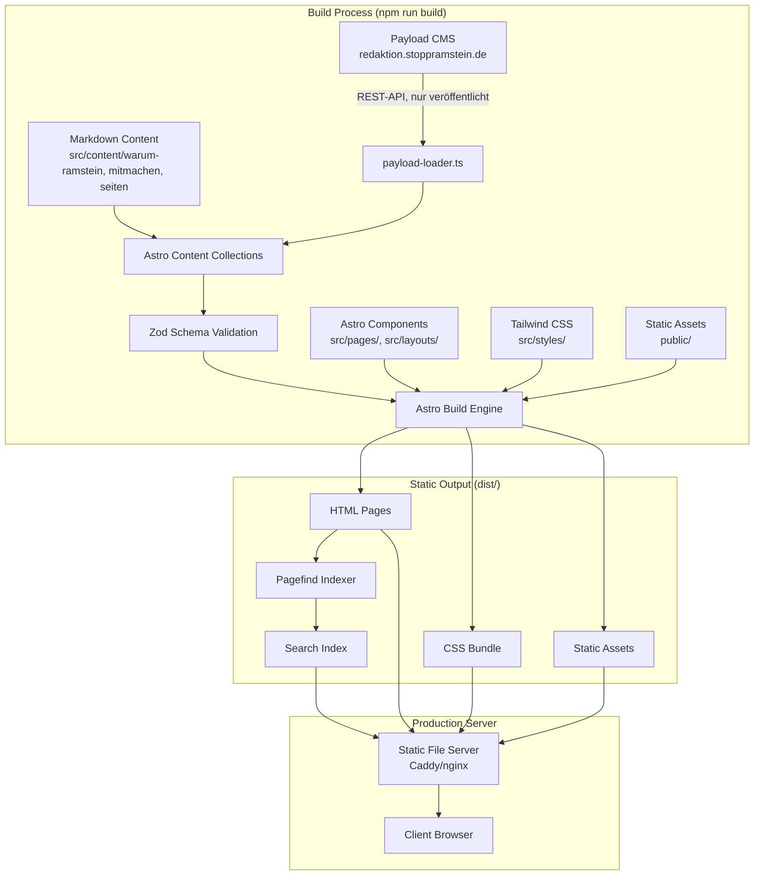
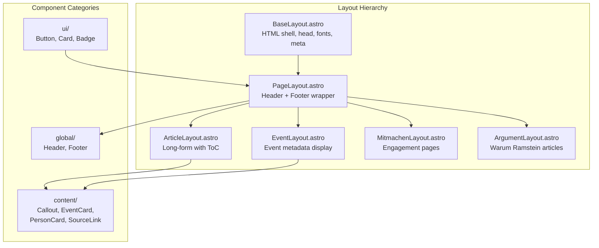
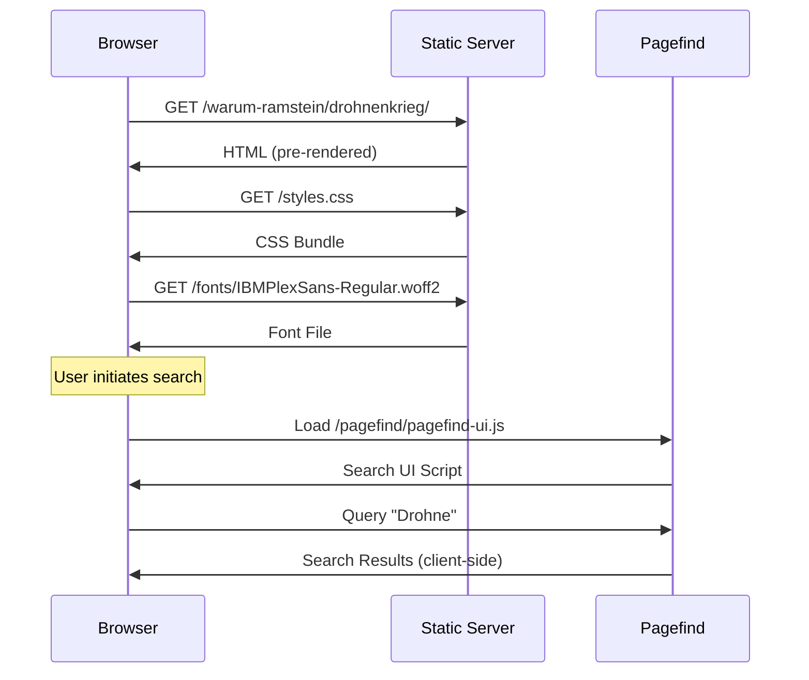
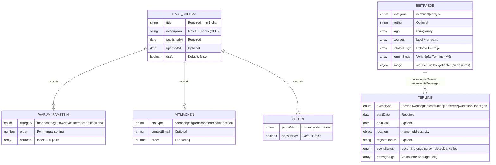
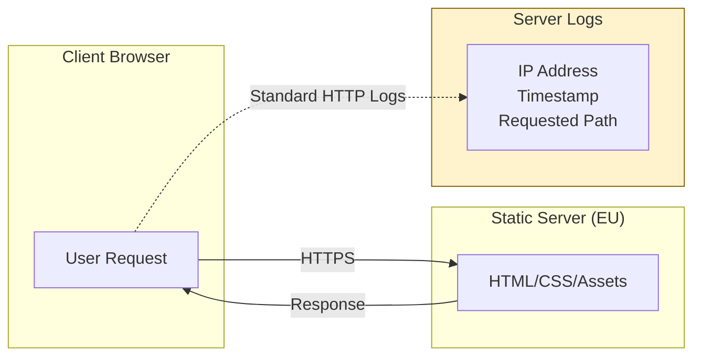

# Architektur

Technischer Überblick über SAR2.0: Datenfluss, Komponenten-Hierarchie, Content-Collection-Schema und Verzeichnisstruktur.

## Tech-Stack

| Layer | Technologie | Version | Zweck |
|-------|-------------|---------|-------|
| Framework | Astro | 5.1.1 | Statische Seitengenerierung, kein JS by default |
| Content | Astro Content Collections | — | Typsicheres Markdown mit Zod-Validierung |
| Styling | Tailwind CSS | 3.4.17 | Utility-first CSS |
| Typografie | `@tailwindcss/typography` | 0.5.16 | Prose-Styling für Artikel |
| Typsicherheit | TypeScript | 5.7.3 | Strict Mode |
| Suche | Pagefind | 1.3.0 | Statischer, clientseitiger Suchindex |
| Bildoptimierung | sharp | 0.33.5 | Für `scripts/generate-assets.mjs` |
| Redaktion (Build-Zeit-Quelle) | Payload CMS 3 + PostgreSQL | siehe `cms/package.json` | Eigenständiges Projekt in `cms/`, siehe Abschnitt "CMS-Integration" unten |

Selbst gehostete Schriften: IBM Plex Sans/Serif/Mono unter `public/fonts/`. Keine Google Fonts, keine externen CDNs (siehe CLAUDE.md).

**Wichtige Grenze:** `cms/` ist eine eigenständige Next.js/React-Anwendung für die Redaktion. Sie wird **nie** in den öffentlichen Astro-Build eingebunden und läuft ausschließlich unter einer eigenen Subdomain (`redaktion.stoppramstein.de`). Das "keine JS-Frameworks"-Verbot aus `CLAUDE.md` bezieht sich auf die öffentliche Seite (`dist/`) — nicht auf dieses interne Redaktionswerkzeug.

## Pfad-Aliase

Definiert in `tsconfig.json`:

| Alias | Zielt auf |
|-------|-----------|
| `@/*` | `src/*` |
| `@components/*` | `src/components/*` |
| `@layouts/*` | `src/layouts/*` |
| `@content/*` | `src/content/*` |
| `@styles/*` | `src/styles/*` |
| `@utils/*` | `src/utils/*` (Ordner existiert aktuell nicht — reservierter Alias, noch ungenutzt) |

## Datenfluss beim Build



Der Payload-Fetch passiert **ausschließlich zur Build-Zeit** (im `payload-loader.ts`, siehe Abschnitt "CMS-Integration"). Die ausgelieferte Website braucht Payload nie zur Laufzeit — fällt das CMS nach einem erfolgreichen Build aus, liefert `dist/` unverändert weiter aus.

## Komponenten-Hierarchie



> Hinweis: `src/components/interactive/` ist in der Kategorisierung vorgesehen, existiert im Repo aktuell aber noch nicht.

## Request-Flow (statische Seite)



## Content-Collection-Schema

Definiert in **`src/content.config.ts`** (Astro Content Layer API — die einzige geladene Config-Datei; ein `src/content/config.ts` daneben würde ignoriert, siehe Hinweis unten). Alle fünf Collections leben in dieser einen Datei; ein Build bricht ab, wenn die Daten nicht zum Zod-Schema passen. Details zu den Pflichtfeldern pro Collection: siehe [INHALTE-PFLEGEN.md](./INHALTE-PFLEGEN.md).

- **Git-Markdown-Collections** (`warum-ramstein`, `mitmachen`, `seiten`): `glob()`-Loader gegen `src/content/<collection>/*.md`, Basis-Schema (`baseSchema`) wie bisher.
- **CMS-Collections** (`beitraege`, `termine`): `payloadLoader()` (`src/lib/payload-loader.ts`), fetcht zur Build-Zeit gegen Payload — oder, wenn `PAYLOAD_URL` nicht gesetzt ist (lokale Entwicklung ohne laufendes `cms/`, sowie CI), gegen eine committete Fixture unter `src/content/_fixtures/`.

> **Wichtig:** Astro lädt genau eine Config-Datei für Content Collections (`content.config.ts` hat Vorrang vor dem alten `content/config.ts`, es gibt kein Zusammenführen). Deshalb sind hier bewusst alle fünf Collections in einer Datei zusammengefasst, statt die CMS-Collections in eine separate Datei auszulagern.



`beitraege` und `termine` erweitern nicht `baseSchema` (sie haben kein `draft`-Feld — Sichtbarkeit läuft über den redaktionellen `freigabeStatus` in Payload, siehe CMS-Integration).

## Datenverarbeitung (Art. 13 DSGVO)



Die Website sammelt keine Nutzerdaten über Standard-HTTP-Server-Logs hinaus: keine Cookies, keine Analytics, keine Third-Party-Tracker, keine serverseitige Formularverarbeitung (Kontakt läuft über `mailto:`-Links). Details: `/datenschutz/`.

## Verzeichnisstruktur

```
SAR2.0/
├── src/
│   ├── content.config.ts           # Schema-Definitionen ALLER Collections (SINGLE SOURCE OF TRUTH)
│   ├── content/
│   │   ├── warum-ramstein/         # index, drohnenkrieg, voelkerrecht, deutschland, umwelt
│   │   ├── mitmachen/               # spenden, mitglied-werden, ehrenamt, aufruf
│   │   ├── seiten/                  # impressum, kontakt, ueber-uns, fakten, datenschutz, presse
│   │   └── _fixtures/                # beitraege.json, termine.json - Fallback-Daten ohne laufendes cms/ (CI, lokal)
│   │
│   ├── lib/
│   │   └── payload-loader.ts       # Content-Layer-Loader gegen die Payload-API (Build-Zeit-only)
│   ├── pages/                      # Datei-basiertes Routing (+ [...slug].astro pro Collection)
│   ├── layouts/                    # BaseLayout, PageLayout, ArticleLayout, EventLayout, MitmachenLayout, ArgumentLayout
│   ├── components/
│   │   ├── global/                 # Header, Footer
│   │   ├── ui/                     # Button, Card, Badge
│   │   └── content/                # Callout, EventCard, PersonCard, SourceLink
│   │
│   └── styles/
│       └── global.css              # Tailwind-Direktiven + CSS Custom Properties (Design-Tokens)
│
├── public/
│   ├── media/cms/                  # Von payload-loader.ts heruntergeladene CMS-Bilder (build-generiert, git-ignoriert)
│   └── scripts/                    # Page-Scripts als externe Dateien (CSP: script-src 'self', keine Inline-Scripts)
├── scripts/                        # check-links.mjs, check-csp.mjs, generate-assets.mjs
├── tools/                          # scraper.py (einmaliges Migrationswerkzeug, siehe unten)
├── stoppramstein_content/          # Migrierte WordPress-Inhalte — nur lesen, nicht verändern
├── docs/                           # Diese Dokumentation
├── dist/                           # Build-Output (git-ignoriert)
│
├── cms/                            # Payload CMS 3 + PostgreSQL - eigenständiges npm-Projekt (siehe unten)
│
├── astro.config.mjs
├── tailwind.config.mjs
├── tsconfig.json
├── guidelines.md                   # Ausführliche Projektregeln
├── CLAUDE.md                       # Verbindliche Regeln für KI-Assistenten
└── package.json
```

## CMS-Integration (Payload CMS 3)

`cms/` ist ein vollständig eigenständiges npm-Projekt (eigene `package.json`/`package-lock.json`, **kein** npm-Workspace mit dem Astro-Root) — Astro- und Payload-Abhängigkeiten werden bewusst getrennt aktualisiert. Der Astro-Root bekommt dadurch nie ein Payload-Paket als Abhängigkeit.

```
cms/
├── src/
│   ├── payload.config.ts           # DB-Adapter, Editor-Feature-Allowlist, Collections, Jobs Queue
│   ├── collections/                # Users (Rollen), Media (Upload+Alt-Pflicht), Beitraege, Termine
│   ├── access/                     # Rollen-/Status-Zugriffsregeln (M2, M5)
│   ├── hooks/                      # triggerRebuild (M9), setPublishedAt, addRenderedHtml, setCreatedBy
│   ├── jobs/schedulePublish.ts     # Zeitgesteuerte Veröffentlichung (M5)
│   ├── fields/, lib/               # Geteilte Feld-Definitionen, Lexical→HTML-Konvertierung
│   └── app/(payload)/              # Next.js-Admin-Oberfläche (Payload-Standard-Scaffold)
├── scripts/                        # seed-import.ts (Migration), export-content.mjs (M10)
├── webhook/rebuild-server.mjs      # M9: nimmt Publish-Webhook entgegen, baut, tauscht dist/ atomar
├── backup/                         # M10: nächtliches pg_dump + Uploads-Backup
└── docker-compose.yml              # Payload, Postgres, rebuild-webhook, backup - ein Server (siehe DEPLOYMENT.md)
```

Vollständige Entwickler-Referenz (Setup, Umgebungsvariablen, Datenmodell im Detail, Scripts, Troubleshooting): [`cms/README.md`](../cms/README.md).

**Datenmodell (M2, M5, M6):** Rollen `autor` (eigene Entwürfe) / `redaktion` (freigeben, veröffentlichen) / `admin` auf der `users`-Collection. Redaktioneller Status `entwurf → zur_freigabe → veroeffentlicht` als eigenes Feld (Payloads natives `drafts`/`versions` läuft zusätzlich als Revisionssicherung, ersetzt aber nicht den 3-stufigen Freigabeprozess). `beitraege.verknuepfterTermin` (relationship) und `termine.verknuepfteBeitraege` (join-Feld, spiegelt automatisch) bilden die Beitrag↔Termin-Verknüpfung aus M6 — gepflegt wird nur die Beitragsseite.

**Rich Text (M3):** Lexical (Payloads eingebauter Rich-Text-Editor) mit bewusster Feature-Allowlist (Überschriften, Listen, Links, Zitate, Bilder) — **keine** HTML-Block-/Embed-Features, damit strukturell kein `<script>`/Inline-HTML eingeschleust werden kann. Konvertierung zu HTML passiert server-seitig in `cms/` (`lexicalToHtml.ts`, per `afterRead`-Hook als `renderedHtml`-Feld); der Astro-Loader konsumiert nur den fertigen String.

**Bilder (M4, CSP):** Die Produktions-CSP ist `img-src 'self' data:` — Bilder dürfen also nicht direkt von der CMS-Domain eingebunden werden. `payload-loader.ts` lädt referenzierte Medien deshalb **während des Builds** herunter nach `public/media/cms/` und verweist im Content-Layer-Datensatz auf den lokalen Pfad. Bilder funktionieren dadurch auch, wenn das CMS nach dem Build offline ist.

**Astro-Anbindung:** `src/lib/payload-loader.ts` fetcht bei gesetztem `PAYLOAD_URL` live von Payloads REST-API (nur `freigabeStatus: veroeffentlicht`, `publishedAt <= jetzt`) — Nichterreichbarkeit lässt den Build laut fehlschlagen. Ohne `PAYLOAD_URL` (lokal ohne laufendes `cms/`, und in CI) wird stattdessen `src/content/_fixtures/{beitraege,termine}.json` gelesen, damit `npm run verify` auch ohne Docker/Postgres lauffähig bleibt.

**Automatischer Rebuild (M9) und Backups (M10):** siehe [DEPLOYMENT.md](./DEPLOYMENT.md).

## Migrationswerkzeug

`tools/scraper.py` extrahiert Inhalte von der alten WordPress-Seite nach `stoppramstein_content/`. Einmaliges Werkzeug, nicht Teil des Build-Prozesses. Ausführung: `cd tools && pip install -r requirements.txt && python scraper.py`.
