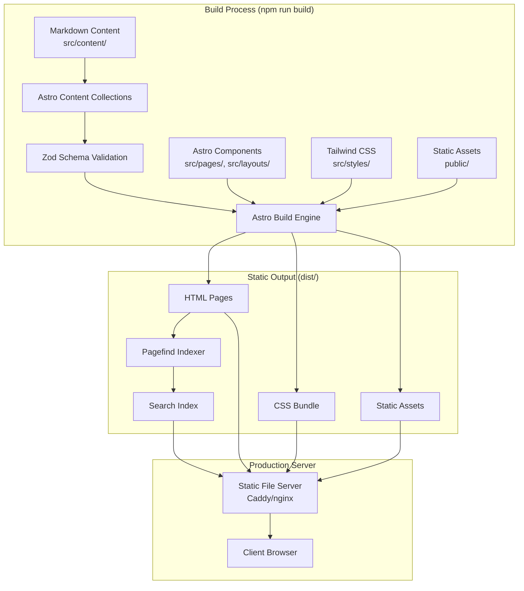
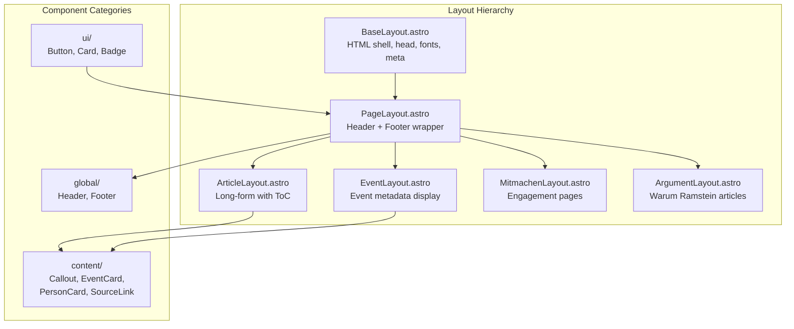
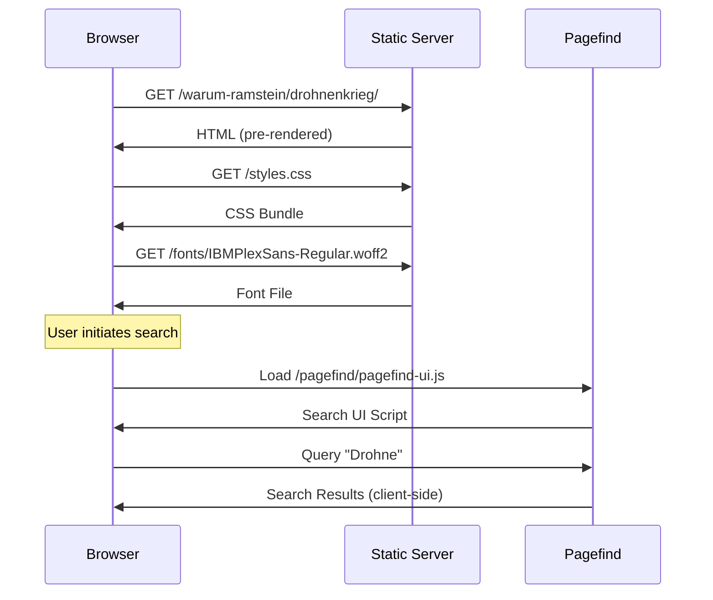
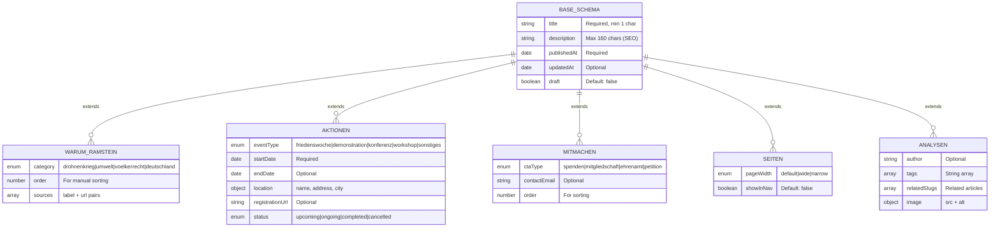
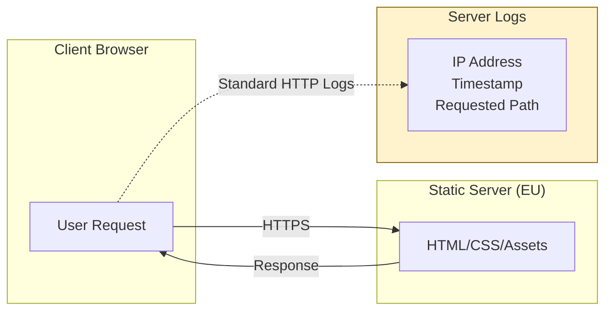

# Architektur

Technischer Überblick über SAR2.0: Datenfluss, Komponenten-Hierarchie, Content-Collection-Schema und Verzeichnisstruktur.

## Tech-Stack

| Layer | Technologie | Version | Zweck |
|-------|-------------|---------|-------|
| Framework | Astro | 5.1.1 | Statische Seitengenerierung, kein JS by default |
| Content | Astro Content Collections | — | Typsicheres Markdown mit Zod-Validierung |
| Styling | Tailwind CSS | 3.4.17 | Utility-first CSS |
| Typografie | `@tailwindcss/typography` | 0.5.16 | Prose-Styling für Artikel |
| Typsicherheit | TypeScript | 5.7.3 | Strict Mode |
| Suche | Pagefind | 1.3.0 | Statischer, clientseitiger Suchindex |
| Bildoptimierung | sharp | 0.33.5 | Für `scripts/generate-assets.mjs` |

Selbst gehostete Schriften: IBM Plex Sans/Serif/Mono unter `public/fonts/`. Keine Google Fonts, keine externen CDNs (siehe CLAUDE.md).

## Pfad-Aliase

Definiert in `tsconfig.json`:

| Alias | Zielt auf |
|-------|-----------|
| `@/*` | `src/*` |
| `@components/*` | `src/components/*` |
| `@layouts/*` | `src/layouts/*` |
| `@content/*` | `src/content/*` |
| `@styles/*` | `src/styles/*` |
| `@utils/*` | `src/utils/*` (Ordner existiert aktuell nicht — reservierter Alias, noch ungenutzt) |

## Datenfluss beim Build



## Komponenten-Hierarchie



> Hinweis: `src/components/interactive/` ist in der Kategorisierung vorgesehen, existiert im Repo aktuell aber noch nicht.

## Request-Flow (statische Seite)



## Content-Collection-Schema

Definiert in `src/content/config.ts`. Alle Collections erweitern das Basis-Schema (`baseSchema`); ein Build bricht ab, wenn Frontmatter nicht dazu passt. Details zu den Pflichtfeldern pro Collection: siehe [INHALTE-PFLEGEN.md](./INHALTE-PFLEGEN.md).



## Datenverarbeitung (Art. 13 DSGVO)



Die Website sammelt keine Nutzerdaten über Standard-HTTP-Server-Logs hinaus: keine Cookies, keine Analytics, keine Third-Party-Tracker, keine serverseitige Formularverarbeitung (Kontakt läuft über `mailto:`-Links). Details: `/datenschutz/`.

## Verzeichnisstruktur

```
SAR2.0/
├── src/
│   ├── content/                    # Astro Content Collections
│   │   ├── config.ts               # Schema-Definitionen (SINGLE SOURCE OF TRUTH)
│   │   ├── warum-ramstein/         # index, drohnenkrieg, voelkerrecht, deutschland, umwelt
│   │   ├── aktionen/                # friedenswoche-2026
│   │   ├── mitmachen/               # spenden, mitglied-werden, ehrenamt, aufruf
│   │   ├── seiten/                  # impressum, kontakt, ueber-uns, fakten, datenschutz, presse
│   │   └── analysen/                 # der-griff-nach-groenland, venezuela-ramstein
│   │
│   ├── pages/                      # Datei-basiertes Routing (+ [...slug].astro pro Collection)
│   ├── layouts/                    # BaseLayout, PageLayout, ArticleLayout, EventLayout, MitmachenLayout, ArgumentLayout
│   ├── components/
│   │   ├── global/                 # Header, Footer
│   │   ├── ui/                     # Button, Card, Badge
│   │   └── content/                # Callout, EventCard, PersonCard, SourceLink
│   │
│   └── styles/
│       └── global.css              # Tailwind-Direktiven + CSS Custom Properties (Design-Tokens)
│
├── public/                         # Statische Assets (unverändert kopiert)
├── scripts/                        # check-links.mjs, check-csp.mjs, generate-assets.mjs
├── tools/                          # scraper.py (einmaliges Migrationswerkzeug, siehe unten)
├── stoppramstein_content/          # Migrierte WordPress-Inhalte — nur lesen, nicht verändern
├── docs/                           # Diese Dokumentation
├── dist/                           # Build-Output (git-ignoriert)
│
├── astro.config.mjs
├── tailwind.config.mjs
├── tsconfig.json
├── guidelines.md                   # Ausführliche Projektregeln
├── CLAUDE.md                       # Verbindliche Regeln für KI-Assistenten
└── package.json
```

## Migrationswerkzeug

`tools/scraper.py` extrahiert Inhalte von der alten WordPress-Seite nach `stoppramstein_content/`. Einmaliges Werkzeug, nicht Teil des Build-Prozesses. Ausführung: `cd tools && pip install -r requirements.txt && python scraper.py`.
